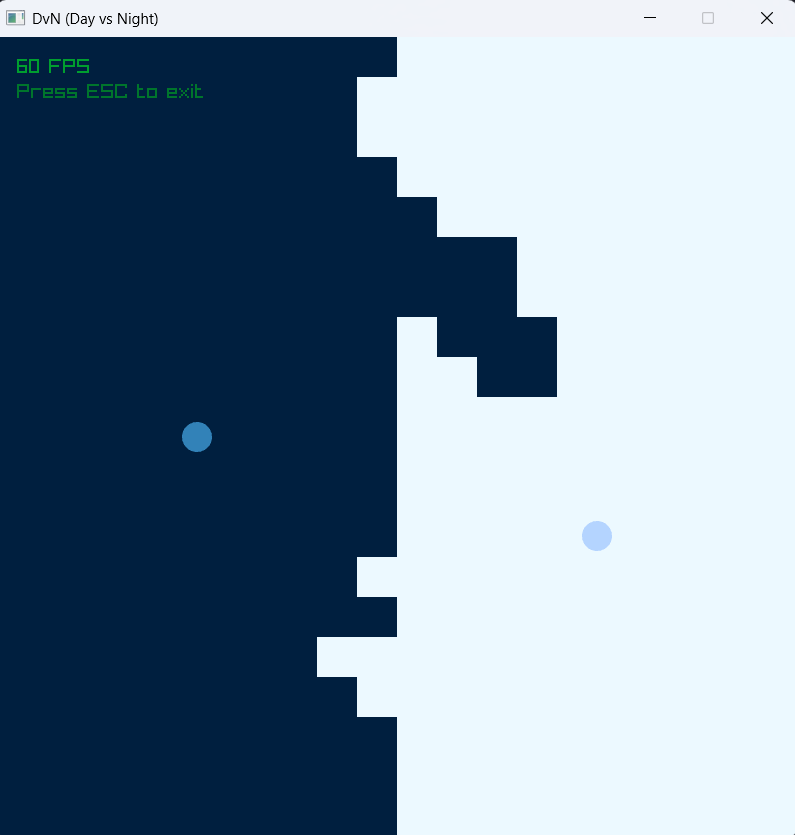

# DvN
DvN (Day vs Night) is an automatic game that runs only by the computer.

## Build
1. Download Raylib precompiled package from the [official releases](https://github.com/raysan5/raylib/releases) for your platform.
2. In the project root directory, extract the archive and rename the resulting directory to `raylib`.
3. Build the project with CMake:
```bash
mkdir -p build
cmake -B build -S .
cmake --build build --config Release
```

## Run
Running the executable is different if you built the project with MSVC:
```powershell
.\build\dvn\Release\dvn.exe
```
Other platforms with `clang` or `gcc`:
```bash
./build/dvn/dvn
```

## Photo

